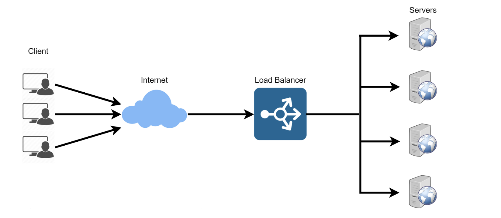

# Implementing-Load-Balancer-with-Nginx
Implementing Load Balancer with Nginx is a common task in many production environments. 



## A. Introduction to Load Balancing and Nginx
Load balancing is the practice of distributing incoming network traffic or workload across multiple servers, services, or resources to ensure optimal utilization of resources, improve response times, maximize throughput, and enhance the reliability and availability of applications and services.

Nginx (pronounced "engine-x") is known for its ability to efficiently handle a large number of concurrent connections and serve web content quickly.


## B. Setting Up a Basic Load Balancer
We are going to be provisioning two EC2 instances running ubuntu 22.04 and install apache webserver in them. We will open port 8000 to allow traffic from anywhere, and finaly update the default page of the webservers to display their public IP address.


Next we will provision another EC2 instance running buntu 22.04, this time we will install Nginx and configure it to act as a load balancer distributing traffic across the webservers.

### 1. Provision EC2 Instances
EC2 instances are created through the AWS Management Console or CLI, allowing you to select configurations and enhance availability by placing them in specific Availability Zones. 

> Open your AWS Management Console, click on EC2. Scroll down the page and click on Launch instance:


> Under Applications and OS Images, click on quick start and click on ubuntu:


> Instances launched


### 2. Open Port 8000 in the security group of each of our webservers

To secure web traffic on port 8000, modify the associated security group's rules within the AWS EC2 dashboard, ensuring that access is restricted to trusted sources.

> Select your instance, scroll down the security tab, and select instance security group


> Modify access to allow traffic on port 8000


### 3. Install Apache Webserver
Installing the Apache web server on an Ubuntu server is a fundamental step in setting up a web hosting environment. This process ensures that your server can serve web content, making it accessible to users over the internet.


> SSH into these instances using putty or another terminal client (or use AWS's session manager). 

* If you're using your local terminal, navigate to the directory containing your key pair:
 ```
 cd ./folder-containing-key-pair
 ```
* Run this command, if necessary, to ensure your key is not publicly viewable:
```
chmod 400 docker.pem
```
* Connect to your instance using its Public DNS:
```
ssh -i "key-pair.pem" ubuntu@your-instance-public-dns
```
* If you're prompted to answer a question, choose `yes`


> Install Apache into the instance using the command below:

```
sudo apt update -y &&  sudo apt install apache2 -y
```


> Verify that apache is running using the command below

```
sudo systemctl status apache2
```


### 4. Configure Apache to serve a page showing its public IP

Configure Apache to serve a page showing its public IP: Customize Apache's configuration files to create a page that displays the server's public IP address, simplifying the verification of the Apache web server's functionality.

We will start by configuring Apache webserver to serve content on port 8000 instead of its default which is port 80. Then we will create a new index.html file. The file will contain code to display the public IP of the EC2 instance. We will then override apache webserver's default html file with our new file.

> Using your text editor(eg vi, nano) open the file /etc/apache2/ports.conf

```
sudo nano /etc/apache2/ports.conf 

```

> Add a new Listen directive for port 8000:


> Open the file /etc/apache2/sites-available/000-default.conf and change port 80 on the virtualhost to 8000 like the screenshot below:

```
sudo nano /etc/apache2/sites-available/000-default.conf
```


> Save and exit from the text editor. Restart apache to load the new configuration using the command below:

```
sudo systemctl restart apache2
```

> Create a new html file:

```
sudo nano index.html
```

> Paste the html file below. Before pasting the html file, get the public IP of your EC2 instance from AWS Management Console and replace the placeholder text for IP address in the html file.

```
        <!DOCTYPE html>
        <html>
        <head>
            <title>My EC2 Instance</title>
        </head>
        <body>
            <h1>Welcome to my EC2 instance</h1>
            <p>Public IP: YOUR_PUBLIC_IP</p>
        </body>
        </html>
```


> Change file ownership of the index.html file with the command below:

```
sudo chown www-data:www-data ./index.html
```

> Overriding the Default html file of Apache Webserver:

```
sudo cp -f ./index.html /var/www/html/index.html
```

> Restart the webserver to load the new configuration using the command below:

```
sudo systemctl restart apache2
```


> When you visit **http://"your-public-ip":8000** on your web browser you should find a page like so:

```
http://"your-public-ip":8000
```


#### _NB: Change in my Public IP Addresses_

_I took a break from this project and had to stop my EC2 instances to prevent excess charges. This resulted in new public IP addresses for the web servers in the next section. Please note that **you don't need to change your IP address**. Thank you for your understanding._


### 5. Configuring Nginx as a Load Balancer

Integrating Nginx as a load balancer on your instance is a pivotal step in creating a high-availability web hosting environment.


This configuration ensures that incoming web traffic is efficiently distributed across multiple web servers, improving the performance and reliability of your applications. You can install Nginx with the following command:


> Provision a new EC2 instance running ubuntu 22.04. 


> Make sure port 80 is opened to accept traffic from anywhere. 


> Instance launched


> Next SSH into the instance

* If you're using your local terminal, navigate to the directory containing your key pair:
 ```
 cd ./folder-containing-key-pair
 ```
* Run this command, if necessary, to ensure your key is not publicly viewable:
```
chmod 400 docker.pem
```
* Connect to your instance using its Public DNS:
```
ssh -i "key-pair.pem" ubuntu@your-instance-public-dns
```
* If you're prompted to answer a question, choose `yes`


> Install Nginx into the instance using the command below:

```
sudo apt update -y && sudo apt install nginx -y
```


> Verify that Nginx is installed with the command below:

```
sudo systemctl status nginx
```


> Open Nginx configuration file with the command below:

```
sudo nano /etc/nginx/conf.d/loadbalancer.conf
```

> Paste the configuration file below to configure nginx to act like a load balancer. A screenshot of an example config file is shown below:

```
        upstream backend_servers {

            # your are to replace the public IP and Port to that of your webservers
            server 127.0.0.1:8000; # public IP and port for webserser 1
            server 127.0.0.1:8000; # public IP and port for webserver 2

        }

        server {
            listen 80;
            server_name <your load balancer's public IP addres>; # provide your load balancers public IP address

            location / {
                proxy_pass http://backend_servers;
                proxy_set_header Host $host;
                proxy_set_header X-Real-IP $remote_addr;
                proxy_set_header X-Forwarded-For $proxy_add_x_forwarded_for;
            }
        }
```

* Make sure you edit the file and provide necessary information like your server IP address etc.

* **upstream backend_servers** defines a group of backend servers. The **server** lines inside the **upstream** block list the addresses and ports of your backend servers. **proxy_pass** inside the location block sets up the load balancing, passing the requests to the backend servers.

* **The proxy_set_header** lines pass necessary headers to the backend servers to correctly handle the requests

> Save and close the editor by pressing `CTRL+X`, then confirm saving changes by typing `Y` and hitting Enter.


> Test your configuration with the command below:

```
sudo nginx -t
```


> If there is no error, then restart the Nginx service using this command:

```
sudo systemctl restart nginx
```

### Now we have our load balancer setup!

> Now that our load balancer is set up, let's test it by accessing the Load Balancer's Public DNS name from a web browser. We should see server 1 and server 2 taking turns serving web pages: 

```
http://<Load-Balancer-Public-IP-Address>:80
```


You can see server 1 and server 2 taking turns serving web pages.

#### Congratulations on setting up a basic Load Balancing environment in AWS


### 6. Load balancing algorithms 

Load balancing algorithms are essential in distributed computing and networking to distribute network traffic or computational tasks across multiple servers or resources efficiently. They ensure that no single resource is overwhelmed while others remain underutilized. Here are some common load balancing algorithms:

> Round Robin: This is one of the simplest load balancing algorithms. It distributes incoming requests or tasks equally among the available servers in a circular order. It's easy to implement but doesn't consider server health or load, which can lead to uneven load distribution.

> Least Connections: This algorithm directs traffic to the server with the fewest active connections at the moment. It helps distribute load more evenly by sending new connections to less busy servers. However, it doesn't consider server capacity or the nature of the requests.

> Weighted Round Robin: This is an extension of the Round Robin algorithm, where each server is assigned a weight that reflects its capacity or performance. Servers with higher weights receive more requests. It allows you to allocate more traffic to powerful servers.

> Weighted Least Connections: Similar to Weighted Round Robin, this algorithm assigns weights to servers based on their capacity. However, it directs traffic to the server with the fewest active connections, taking into account the weights. This provides both load balancing and capacity-aware routing.

> Least Response Time: This algorithm sends requests to the server that has the lowest response time or latency. It helps distribute traffic to servers that can process requests more quickly. However, it may not be suitable for all applications or when server conditions change rapidly.

> IP Hash: IP-based load balancing calculates a hash value based on the source or destination IP address of incoming requests. This hash determines which server should handle the request. It's particularly useful for ensuring that requests from the same client are consistently directed to the same server.

> Least Bandwidth: This algorithm directs requests to the server with the least amount of outgoing traffic or bandwidth usage. It's useful when the bandwidth of the servers is a critical factor.

> Randomized Load Balancing: This approach randomly selects a server to handle each incoming request. While simple to implement, it doesn't guarantee even load distribution and may lead to imbalances.

> Dynamic Load Balancing: These algorithms continuously monitor server performance and workload, dynamically adjusting the load distribution. They can use various metrics, such as CPU usage, memory usage, or response times, to make real-time decisions.

> Content-Based Load Balancing: This method examines the content or type of request and routes it to a server optimized for handling that specific content or service. It's common in content delivery networks (CDNs) and web application firewalls.

> Application-Aware Load Balancing: These advanced algorithms are aware of the application layer protocols and can make load balancing decisions based on the content of the application data. They are commonly used in complex applications like HTTP, HTTPS, or FTP.

### 7. Advanced Load Balancing 

Advanced load balancing features play a crucial role in optimizing application performance, ensuring high availability, and providing security and scalability. Here's a more detailed look at some of these features:

> SSL Offloading/Termination: SSL offloading enables load balancers to handle SSL encryption and decryption, reducing the computational load on backend servers. It enhances security and performance by allowing load balancers to handle SSL/TLS protocols efficiently.

> Session Persistence/Sticky Sessions: Some applications, like those requiring user authentication or maintaining session state, benefit from sticky sessions. Load balancers can use cookies or IP-based methods to ensure that a client's requests consistently go to the same backend server for the duration of their session.

> Health Checks and Automatic Server Failover: Load balancers perform regular health checks on backend servers. If a server becomes unresponsive or unhealthy, the load balancer can automatically remove it from the server pool, ensuring that traffic is redirected to healthy servers for high availability.

> Global Server Load Balancing (GSLB): GSLB extends load balancing across multiple data centers or geographic locations. It directs traffic to the nearest or most available data center, improving user experience and offering disaster recovery capabilities.

> Application-Layer Load Balancing: Advanced load balancers can inspect application-specific attributes like HTTP headers and content to make routing decisions. For example, they can route traffic based on URLs, content type, or user agent, optimizing application delivery.

> Dynamic Load Balancing: Load balancers can use real-time analytics and machine learning to adaptively adjust server weights or routing decisions based on current server performance, network conditions, and application demands. This adaptability ensures efficient resource utilization and application responsiveness.

> Anycast Load Balancing: Anycast allows multiple load balancer instances to share the same IP address across different locations. When a client sends a request, it is routed to the nearest load balancer instance, reducing latency and improving performance for distributed applications.

> Rate Limiting and Traffic Shaping: Load balancers can enforce rate limits on incoming requests from clients, preventing denial-of-service attacks and controlling resource utilization. They can also shape traffic, prioritizing certain types of requests over others based on defined policies, ensuring fair allocation of resources.

> Web Application Firewall (WAF) Integration: Some load balancers offer integrated Web Application Firewall (WAF) functionality. This helps protect web applications from common security threats such as SQL injection, cross-site scripting (XSS), and other vulnerabilities by inspecting and filtering incoming traffic for malicious content.

These advanced load balancing features are essential in modern IT infrastructures to provide high performance, availability, security, and scalability for applications and services. The choice of features to use depends on the specific needs of the application and the infrastructure in place.